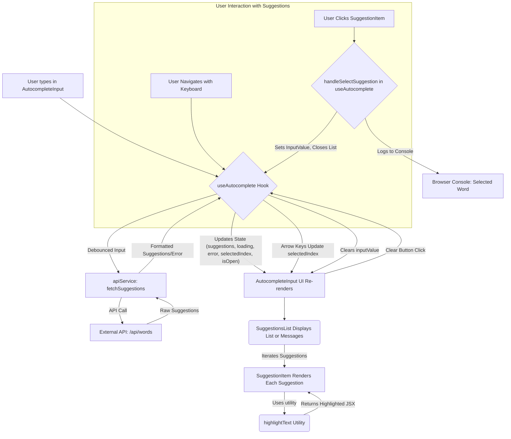

# Word Autocomplete UI Component

This project is a React + TypeScript application that provides a user interface for word autocomplete functionality. Users can type into an input field, and the application will fetch and display word suggestions from an API. Selected suggestions are logged to the console.

## Key Functionalities

*   **Real-time Suggestions**: Fetches and displays word suggestions as the user types.
*   **Debounced API Calls**: API calls are debounced to prevent excessive requests while typing.
*   **Keyboard Navigation**: Users can navigate suggestions using Arrow Up/Down keys, select with Enter, and dismiss with Escape.
*   **Click Selection**: Users can select suggestions by clicking on them.
*   **Clear Input**: A button to quickly clear the input field.
*   **Highlight Matching Text**: The portion of the suggestions matching the input query is highlighted.
*   **Loading & Error States**: Displays appropriate messages during API call loading or if an error occurs.
*   **No Results Message**: Informs the user if no suggestions are found for their query.
*   **Console Logging**: Logs the selected word to the browser console, fulfilling a key PRD requirement.

## Application Flow



## Tech Stack

*   **React 19**
*   **TypeScript**
*   **Vite**: For fast development and optimized builds.
*   **CSS**: Custom CSS for styling (`App.css`, `AutocompleteInput.css`).
*   **Vitest**: For unit and integration testing.
*   **React Testing Library**: For testing React components.
*   **ESLint**: For code linting.

## Project Structure

```
autocomplete-app/
├── public/                  # Static assets
├── src/
│   ├── assets/              # Image/font assets
│   ├── components/          # React UI components (AutocompleteInput, SuggestionItem, SuggestionsList)
│   ├── hooks/               # Custom React hooks (useAutocomplete)
│   ├── services/            # API service layer (apiService)
│   ├── utils/               # Utility functions (highlightText)
│   ├── App.css              # Main app styles
│   ├── App.tsx              # Main application component
│   ├── main.tsx             # Application entry point
│   ├── index.css            # Global styles
│   └── setupTests.ts        # Test setup for Vitest
├── .eslintrc.cjs            # ESLint configuration
├── .gitignore
├── index.html               # Main HTML page
├── package.json
├── tsconfig.json            # TypeScript configuration
├── tsconfig.node.json       # TypeScript configuration for Node
├── vite.config.ts           # Vite configuration
├── vitest.config.ts         # Vitest configuration
└── README.md                # This file
```

## Available Scripts

In the `autocomplete-app` directory, you can run the following scripts:

### `npm run dev`

Runs the app in development mode.
Open [http://localhost:5173](http://localhost:5173) (or the port shown in your terminal) to view it in the browser.
The page will reload if you make edits.

### `npm run build`

Builds the app for production to the `dist` folder.
It correctly bundles React in production mode and optimizes the build for the best performance.

### `npm run lint`

Lints the codebase using ESLint.

### `npm run preview`

Serves the production build locally to preview it.

### `npm run test`

Runs the unit tests using Vitest in watch mode by default (as per original `vitest` script, changed to `vitest run` for single execution). Consider `npm run test:watch` for interactive watch mode.
*   `npm run test`: Executes tests once.
*   `npm run test:watch`: Runs tests in interactive watch mode.

## Setup

1.  Navigate to the `autocomplete-app` directory:
    ```bash
    cd autocomplete-app
    ```
2.  Install dependencies:
    ```bash
    npm install
    ```
3.  To start the development server:
    ```bash
    npm run dev
    ```
